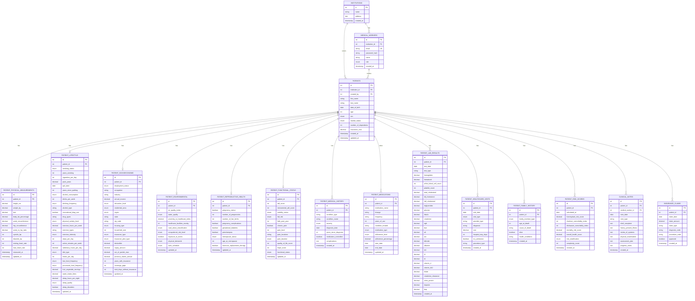

# Database Schema - ER Diagram and PostgreSQL CREATE Statements

## Entity Relationship Diagram

```mermaid
erDiagram
    INSTITUTIONS ||--o{ MEDICAL_WORKERS : has
    INSTITUTIONS ||--o{ PATIENTS : serves
    MEDICAL_WORKERS ||--o{ PATIENTS : creates
    PATIENTS ||--o| PATIENT_PHYSICAL_MEASUREMENTS : has
    PATIENTS ||--o| PATIENT_LIFESTYLE : has
    PATIENTS ||--o| PATIENT_SOCIOECONOMIC : has
    PATIENTS ||--o| PATIENT_ENVIRONMENTAL : has
    PATIENTS ||--o| PATIENT_REPRODUCTIVE_HEALTH : has
    PATIENTS ||--o| PATIENT_FUNCTIONAL_STATUS : has
    PATIENTS ||--o{ PATIENT_MEDICAL_HISTORY : has
    PATIENTS ||--o{ PATIENT_MEDICATIONS : takes
    PATIENTS ||--o{ PATIENT_LAB_RESULTS : has
    PATIENTS ||--o{ PATIENT_HEALTHCARE_VISITS : has
    PATIENTS ||--o{ PATIENT_FAMILY_HISTORY : has
    PATIENTS ||--o{ PATIENT_RISK_SCORES : has
    PATIENTS ||--o{ CLINICAL_NOTES : has
    PATIENTS ||--o{ INSURANCE_CLAIMS : has

    INSTITUTIONS {
        int id PK
        string name
        text address
        timestamp created_at
    }

    MEDICAL_WORKERS {
        int id PK
        int institution_id FK
        string email UK
        string password_hash
        string name
        enum role
        timestamp created_at
    }

    PATIENTS {
        int id PK
        int institution_id FK
        int created_by FK
        string first_name
        string last_name
        date date_of_birth
        int age
        enum sex
        enum marital_status
        int number_of_dependents
        decimal insurance_cost
        timestamp created_at
        timestamp updated_at
    }

    PATIENT_PHYSICAL_MEASUREMENTS {
        int id PK
        int patient_id FK
        decimal height_cm
        decimal weight_kg
        decimal bmi
        decimal body_fat_percentage
        decimal waist_circumference
        decimal hip_circumference
        decimal waist_to_hip_ratio
        int systolic_bp
        int diastolic_bp
        int resting_heart_rate
        int max_heart_rate
        timestamp measured_at
        timestamp updated_at
    }

    PATIENT_LIFESTYLE {
        int id PK
        int patient_id FK
        enum smoking_status
        int years_smoking
        int cigarettes_per_day
        decimal pack_years
        date quit_date
        int years_since_quitting
        enum alcohol_consumption
        int drinks_per_week
        enum drinking_frequency
        string alcohol_type
        boolean recreational_drug_use
        string drug_types
        enum physical_activity_level
        decimal exercise_hours_per_week
        string exercise_types
        enum exercise_intensity
        int steps_per_day
        int active_minutes_per_week
        decimal sedentary_hours_per_day
        enum diet_type
        int meals_per_day
        enum fast_food_frequency
        enum processed_food_frequency
        decimal fruit_vegetable_servings
        decimal water_intake_liters
        decimal sleep_hours_per_night
        enum sleep_quality
        boolean sleep_disorders
        timestamp updated_at
    }

    PATIENT_MEDICAL_HISTORY {
        int id PK
        int patient_id FK
        string condition_type
        string condition_name
        enum severity
        date diagnosis_date
        int years_since_diagnosis
        boolean medication_controlled
        text complications
        timestamp created_at
    }

    PATIENT_MEDICATIONS {
        int id PK
        int patient_id FK
        string medication_name
        string dosage
        string frequency
        int years_of_use
        string condition_treated
        enum medication_type
        enum adherence_level
        decimal adherence_percentage
        date start_date
        date end_date
        timestamp updated_at
    }

    PATIENT_LAB_RESULTS {
        int id PK
        int patient_id FK
        date test_date
        string test_type
        decimal hemoglobin
        decimal hematocrit
        int white_blood_cell_count
        int platelet_count
        decimal total_cholesterol
        decimal ldl_cholesterol
        decimal hdl_cholesterol
        decimal triglycerides
        decimal glucose
        decimal hba1c
        decimal creatinine
        decimal egfr
        decimal bun
        decimal alt
        decimal ast
        decimal bilirubin
        decimal albumin
        decimal tsh
        decimal t3
        decimal t4
        decimal vitamin_d
        decimal vitamin_b12
        decimal folate
        decimal creatinine_clearance
        decimal urine_protein
        decimal troponin
        decimal bnp
        timestamp created_at
    }

    PATIENT_HEALTHCARE_VISITS {
        int id PK
        int patient_id FK
        date visit_date
        enum visit_type
        string provider_type
        string diagnosis
        decimal cost
        int hospital_stay_days
        boolean icu_admission
        string procedure_type
        timestamp created_at
    }

    PATIENT_FAMILY_HISTORY {
        int id PK
        int patient_id FK
        enum family_member_type
        int age_at_death
        string cause_of_death
        boolean alive
        string health_conditions
        timestamp created_at
    }

    PATIENT_SOCIOECONOMIC {
        int id PK
        int patient_id FK
        enum employment_status
        string occupation
        string industry
        decimal annual_income
        enum education_level
        enum residential_area
        enum region
        string state
        string zip_code
        enum housing_type
        int household_size
        enum insurance_type
        enum insurance_plan_type
        decimal deductible
        decimal copay_amount
        decimal out_of_pocket_max
        decimal previous_claims_annual
        int years_with_insurance
        int coverage_gaps
        int total_days_without_insurance
        timestamp updated_at
    }

    PATIENT_ENVIRONMENTAL {
        int id PK
        int patient_id FK
        int air_quality_index
        enum water_quality
        decimal proximity_to_healthcare_miles
        int healthcare_facilities_nearby
        enum rural_urban_classification
        enum occupational_risk_level
        boolean exposure_to_toxins
        enum physical_demands
        enum work_schedule
        timestamp updated_at
    }

    PATIENT_REPRODUCTIVE_HEALTH {
        int id PK
        int patient_id FK
        boolean pregnancy_status
        int number_of_pregnancies
        int number_of_live_births
        boolean pregnancy_complications
        boolean gestational_diabetes
        boolean preeclampsia
        enum menopause_status
        int age_at_menopause
        boolean hormone_replacement_therapy
        timestamp updated_at
    }

    PATIENT_FUNCTIONAL_STATUS {
        int id PK
        int patient_id FK
        int adl_score
        int instrumental_adl_score
        enum mobility_status
        enum fall_risk
        int falls_past_year
        boolean chronic_pain
        int pain_level
        string pain_locations
        enum pain_duration
        int quality_of_life_score
        int hrqol_score
        enum functional_status
        timestamp updated_at
    }

    PATIENT_RISK_SCORES {
        int id PK
        int patient_id FK
        date calculated_at
        decimal framingham_risk_score
        int charlson_comorbidity_index
        int elixhauser_comorbidity_index
        decimal mortality_risk_score
        decimal overall_health_score
        enum risk_stratification
        int complexity_score
        timestamp created_at
    }

    CLINICAL_NOTES {
        int id PK
        int patient_id FK
        int medical_worker_id FK
        date note_date
        string note_type
        text chief_complaint
        text history_present_illness
        text review_of_systems
        text physical_examination
        text assessment_plan
        text progress_notes
        timestamp created_at
    }

    INSURANCE_CLAIMS {
        int id PK
        int patient_id FK
        date claim_date
        decimal claim_amount
        string claim_type
        string diagnosis_code
        string procedure_code
        boolean approved
        timestamp created_at
    }
```

## PostgreSQL CREATE Statements

