# Entity Relationship Diagram - Federated Medical Insurance Database

## Visual ER Diagram (Mermaid)

```mermaid
erDiagram
    INSTITUTIONS ||--o{ MEDICAL_WORKERS : "has"
    INSTITUTIONS ||--o{ PATIENTS : "serves"
    MEDICAL_WORKERS ||--o{ PATIENTS : "creates"
    MEDICAL_WORKERS ||--o{ CLINICAL_NOTES : "writes"
    
    PATIENTS ||--o| PATIENT_PHYSICAL_MEASUREMENTS : "has"
    PATIENTS ||--o| PATIENT_LIFESTYLE : "has"
    PATIENTS ||--o| PATIENT_SOCIOECONOMIC : "has"
    PATIENTS ||--o| PATIENT_ENVIRONMENTAL : "has"
    PATIENTS ||--o| PATIENT_REPRODUCTIVE_HEALTH : "has"
    PATIENTS ||--o| PATIENT_FUNCTIONAL_STATUS : "has"
    
    PATIENTS ||--o{ PATIENT_MEDICAL_HISTORY : "has"
    PATIENTS ||--o{ PATIENT_MEDICATIONS : "takes"
    PATIENTS ||--o{ PATIENT_LAB_RESULTS : "has"
    PATIENTS ||--o{ PATIENT_HEALTHCARE_VISITS : "has"
    PATIENTS ||--o{ PATIENT_FAMILY_HISTORY : "has"
    PATIENTS ||--o{ PATIENT_RISK_SCORES : "has"
    PATIENTS ||--o{ CLINICAL_NOTES : "has"
    PATIENTS ||--o{ INSURANCE_CLAIMS : "has"
    
    PATIENTS ||--o{ MODEL_VERSIONS : "used_for"
    PATIENTS ||--o{ TRAINING_ROUNDS : "used_in"

    INSTITUTIONS {
        int id PK
        string name
        text address
        timestamp created_at
    }

    MEDICAL_WORKERS {
        int id PK
        int institution_id FK
        string email UK
        string password_hash
        string name
        enum role
        timestamp created_at
    }

    PATIENTS {
        int id PK
        int institution_id FK
        int created_by FK
        string first_name
        string last_name
        date date_of_birth
        int age
        enum sex
        enum marital_status
        int number_of_dependents
        decimal insurance_cost
        timestamp created_at
    }

    PATIENT_PHYSICAL_MEASUREMENTS {
        int id PK
        int patient_id FK
        decimal height_cm
        decimal weight_kg
        decimal bmi
        decimal body_fat_percentage
        int systolic_bp
        int diastolic_bp
        int resting_heart_rate
        timestamp measured_at
    }

    PATIENT_LIFESTYLE {
        int id PK
        int patient_id FK
        enum smoking_status
        int cigarettes_per_day
        enum alcohol_consumption
        int drinks_per_week
        enum physical_activity_level
        decimal exercise_hours_per_week
        enum diet_type
        decimal sleep_hours_per_night
        timestamp updated_at
    }

    PATIENT_MEDICAL_HISTORY {
        int id PK
        int patient_id FK
        string condition_type
        string condition_name
        enum severity
        date diagnosis_date
        timestamp created_at
    }

    PATIENT_MEDICATIONS {
        int id PK
        int patient_id FK
        string medication_name
        string dosage
        string frequency
        enum medication_type
        enum adherence_level
        timestamp created_at
    }

    PATIENT_LAB_RESULTS {
        int id PK
        int patient_id FK
        date test_date
        string test_type
        decimal total_cholesterol
        decimal ldl_cholesterol
        decimal glucose
        decimal hba1c
        timestamp created_at
    }

    PATIENT_HEALTHCARE_VISITS {
        int id PK
        int patient_id FK
        date visit_date
        enum visit_type
        string diagnosis
        decimal cost
        int hospital_stay_days
        timestamp created_at
    }

    PATIENT_FAMILY_HISTORY {
        int id PK
        int patient_id FK
        enum family_member_type
        int age_at_death
        string cause_of_death
        boolean alive
        timestamp created_at
    }

    PATIENT_SOCIOECONOMIC {
        int id PK
        int patient_id FK
        enum employment_status
        string occupation
        decimal annual_income
        enum education_level
        enum region
        string state
        enum insurance_type
        decimal deductible
        timestamp updated_at
    }

    PATIENT_ENVIRONMENTAL {
        int id PK
        int patient_id FK
        int air_quality_index
        enum water_quality
        decimal proximity_to_healthcare_miles
        enum occupational_risk_level
        timestamp updated_at
    }

    PATIENT_REPRODUCTIVE_HEALTH {
        int id PK
        int patient_id FK
        boolean pregnancy_status
        int number_of_pregnancies
        int number_of_live_births
        enum menopause_status
        timestamp updated_at
    }

    PATIENT_FUNCTIONAL_STATUS {
        int id PK
        int patient_id FK
        int adl_score
        enum mobility_status
        enum fall_risk
        boolean chronic_pain
        int pain_level
        int quality_of_life_score
        timestamp updated_at
    }

    PATIENT_RISK_SCORES {
        int id PK
        int patient_id FK
        date calculated_at
        decimal framingham_risk_score
        int charlson_comorbidity_index
        decimal overall_health_score
        enum risk_stratification
        timestamp created_at
    }

    CLINICAL_NOTES {
        int id PK
        int patient_id FK
        int medical_worker_id FK
        date note_date
        enum note_type
        text chief_complaint
        text history_present_illness
        text assessment_plan
        timestamp created_at
    }

    INSURANCE_CLAIMS {
        int id PK
        int patient_id FK
        date claim_date
        decimal claim_amount
        string claim_type
        boolean approved
        timestamp created_at
    }

    MODEL_VERSIONS {
        int id PK
        string version UK
        string model_path
        int training_round
        decimal accuracy
        decimal mse
        boolean is_active
        timestamp trained_at
    }

    TRAINING_ROUNDS {
        int id PK
        int round_number
        int clients_participated
        enum status
        timestamp started_at
        timestamp completed_at
        jsonb metrics
    }
```

## Relationship Summary

### One-to-Many Relationships
- **Institution → Medical Workers**: One institution has many medical workers
- **Institution → Patients**: One institution serves many patients
- **Medical Worker → Patients**: One medical worker can create many patients
- **Medical Worker → Clinical Notes**: One medical worker writes many clinical notes
- **Patient → Physical Measurements**: One patient has one set of physical measurements (1:1)
- **Patient → Lifestyle**: One patient has one lifestyle record (1:1)
- **Patient → Socioeconomic**: One patient has one socioeconomic record (1:1)
- **Patient → Environmental**: One patient has one environmental record (1:1)
- **Patient → Reproductive Health**: One patient has one reproductive health record (1:1)
- **Patient → Functional Status**: One patient has one functional status record (1:1)
- **Patient → Medical History**: One patient can have many medical conditions (1:many)
- **Patient → Medications**: One patient can take many medications (1:many)
- **Patient → Lab Results**: One patient can have many lab results over time (1:many)
- **Patient → Healthcare Visits**: One patient can have many healthcare visits (1:many)
- **Patient → Family History**: One patient can have many family members with history (1:many)
- **Patient → Risk Scores**: One patient can have many risk score calculations over time (1:many)
- **Patient → Clinical Notes**: One patient can have many clinical notes (1:many)
- **Patient → Insurance Claims**: One patient can have many insurance claims (1:many)

### Key Constraints
- **Primary Keys (PK)**: Unique identifier for each table
- **Foreign Keys (FK)**: References to related tables
- **Unique Keys (UK)**: Email addresses, model versions
- **Check Constraints**: Validate data ranges and enums
- **Indexes**: Improve query performance on frequently accessed columns

## Table Count Summary

- **Core Tables**: 3 (institutions, medical_workers, patients)
- **Patient Detail Tables (1:1)**: 6 (physical_measurements, lifestyle, socioeconomic, environmental, reproductive_health, functional_status)
- **Patient Detail Tables (1:many)**: 7 (medical_history, medications, lab_results, healthcare_visits, family_history, risk_scores, clinical_notes)
- **System Tables**: 3 (insurance_claims, model_versions, training_rounds)
- **Total**: 19 tables

## Data Flow

1. **Patient Registration**: Institution → Medical Worker → Patient (core record)
2. **Data Collection**: Patient → Multiple detail tables (1:1 and 1:many)
3. **Training Data**: All patient tables → Federated Learning Model
4. **Predictions**: Model → Insurance Cost (stored in patients.insurance_cost)
5. **Claims**: Patient → Insurance Claims → Cost tracking

## Normalization

The database follows **Third Normal Form (3NF)**:
- Each table represents a single entity
- No redundant data
- Foreign keys maintain referential integrity
- 1:1 relationships for single-instance data
- 1:many relationships for time-series and multiple-instance data

